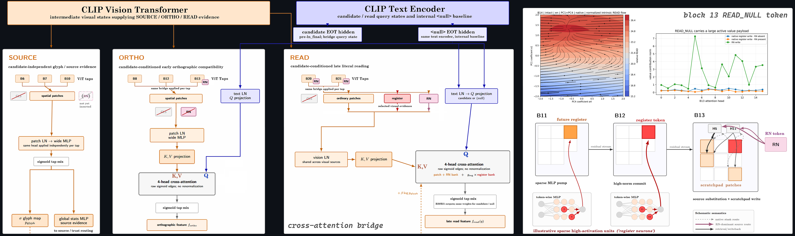
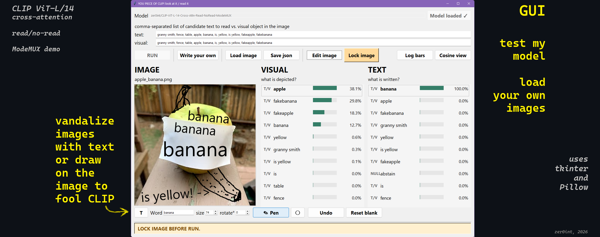
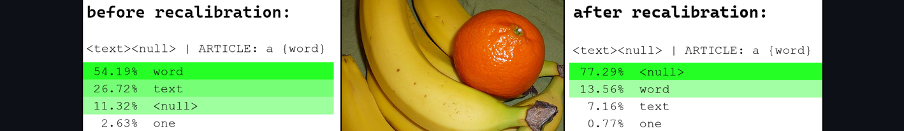
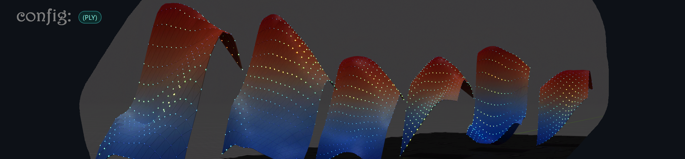
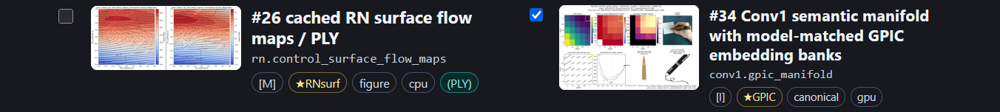
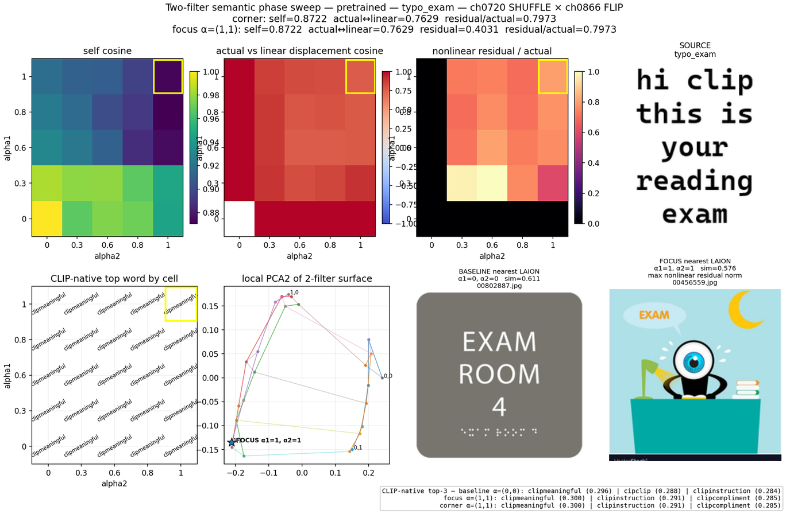

# CLIP Cross-Attention Fine-Tune

## To Read Or Not To Read?
CLIP can do both, with a Cross-Attention Read/No-Read bridge!\


👉 For the full motivation, methods, and results: [see the Paper](x_paper_demo/clip_xattn_bridge_to_read_or_not_to_read.pdf) 📄\
👉 Model: [zer0int/CLIP-ViT-L-14-Cross-Attn-Read-NoRead-ModeMUX](https://huggingface.co/zer0int/CLIP-ViT-L-14-Cross-Attn-Read-NoRead-ModeMUX) 🤗



## 📂 Contens of this repo:

- Train vanilla CLIP ViT-L/14 with a cross-attention bridge
- Usage / API (HF) for trained Cross-Attention ModeMUX model
- Benchmarks (typographic attack, zero-shot, retrieval, linear probe)
- Reproducing mechanistic interpretability results from the paper

Based on [github.com/openai/CLIP](https://github.com/openai/CLIP)

---



Or just try the interactive GUI (via HuggingFace / our model):

```
python a_clip_xattn_reading_demo_gui.py
```


## ⚙️ Dataset preparation (train) 

We provide the [training dataset](https://huggingface.co/datasets/zer0int/CLIP-Cross-Attn-MUX-Training-Data-Pack) via HF for auto-load.\
Exception: ImageNet-1k aka ILSVRC2012. You'll need to supply your existing local copy:


```
python prepare_training_data.py --project-root . --data-root path\to\dl\dataset --imagenet-root path\to\ILSVRC2012
```
💡 Tip: Use `python any_file.py --help` for more configuration info.

This will build the handwriting (overlays included in above) and digital text overlays:
```
python build_imagenet_derivatives.py --project-root . --data-root path\to\dl\dataset --imagenet-root path\to\ILSVRC2012
```
💡 The final size for *all* required datasets is <20 GB.

Optionally, download and enable ObjectNet MVT for benchmark only (train use is disabled):
```
python prepare_objectnet_mvt.py --project-root . --data-root path\to\dl\dataset
```
💡 Typographic attack benchmarks (RTA-100, SCAM) are included in downloads for model evaluation.

---

## 🔥 Training the X-Attn bridge and model

Uses GmP-CLIP [zer0int/CLIP-GmP-ViT-L-14](https://huggingface.co/zer0int/CLIP-GmP-ViT-L-14) 🤗 backbone by default.

### 💨 Smoke Test

Highly recommended: Run a smoke test first. Make:

```
python make_smoke_test_training_config.py --config training_config.local.json --train-root save/model/to/out_smoke
```
💡 The training_config.json is a model (x-attn bridge) configuration (without datasets).

Do a quick (5 min) test to 'touch grad!' 🌱:
```
python train_clip_xattn_bridge.py --config smoke_test_training_config.json
```
💡 Default batch size is designed to fit 24 GB VRAM; adjust `all-weights` (last stage) as needed.

Alternatively, you can test with ~25% of full training (already a good model):
```
python make_intermediate_smoke_test_training_config.py --config training_config.local.json --train-root save/model/to/out_quick
python train_clip_xattn_bridge.py --config intermediate_smoke_test_training_config.json
python verify_smoke_training_updates.py --config intermediate_smoke_test_training_config.json
```
💡 Note: If you see e.g. `[drop] non-finite gradient window at 1c e1 s1` during all-weights initially:\
Keep calm and AdaBelief while CLIP briefly goes 🥒🐈💥🙀 as THAT BRIDGE THING is now attached to it.

### 🎯 Full Training

Full training, with the config saved during initial dataset preparation:
```
python train_clip_xattn_bridge.py --config training_config.local.json
```
🚦 Note that training occurs in multiple stepped phases - not all at once:
```
Training stages, in order:

hard-text → READ → CONTENT → READ+CONTENT
→ 1A → 1B → 1B.5 → router A4 → 1C → all-weights
```
💡 Individual components showing `nan` or `0.0000` while init but still frozen is `normal`.

### 🤗 Exporting the Model

```
python trained_model_hf_conversion.py --export-full-xattn-model --checkpoint "path\to\phase_1c_best_merged_state_dict__ungmp_oaiclip_fullmodel.pt" --training-json the_used_training_config.json --output-dir "path\to\hf_export"
```

💡 If `--export-*` is not passed, exports *all* of below:
```
Full model:             --export-full-xattn-model
RN + ViT correction:    --export-rn-model-correction
Backbone + RN:          --export-rn-model-base
1024-D RN Tensor:       --export-rn-token-only
Text Encoder (raw):     --export-vanilla-text-encoders
```

💡 The `1024-D RN token` can be transplanted to other models of the same family, e.g. OpenAI pretrained CLIP ViT-L/14.\
👉 More info: [zer0int/CLIP-ViT-L-14-Universal-VPT-ReadNull-Token](https://huggingface.co/zer0int/CLIP-ViT-L-14-Universal-VPT-ReadNull-Token)


### 🔧 Final Tap Adjustment

After all-weights (backbone adjustment), the final B20/B21 tap may exhibit edge-case 'text-hallucinations' in arbitrary high-frequency patterns.\
To fine-adjust the operating point, we briefly train:

```
python train_refit_late_reader.py --model "path\to\hf_export\full_xattn_model" --config training_config.local.json --output-root "path\to\late_reader_refit"
```

Find Pareto-Optimal configuration with WiSE-FT:
```
python train_wiseft_late_reader.py pareto --original-model "path\to\hf_export\full_xattn_model" --trained-refit "path\to\late_reader_refit\refit_model" --output-root "path\to\wiseft_pareto" --allow-eval-selection
```
Options: pareto (adaptive alpha sweep) | boundary (monotonic boundary scan) | export (just save with explicit alpha, e.g. --alphas 0.28)



---

## 🤗 Using the trained, exported model

ModeMUX CLIP uses the standard Hugging Face `AutoModel` / `AutoProcessor`
interface with a small mode-aware extension.\
Due to the cross-attention bridge API, requires `trust_remote_code=True`.

<details>
<summary>👉 Click here to expand dummy `transformers` code snippet</summary>

```python
import torch
from PIL import Image
from transformers import AutoModel, AutoProcessor

MODEL_ID = "zer0int/CLIP-ViT-L-14-Cross-Attn-Read-NoRead-ModeMUX"
device = "cuda" if torch.cuda.is_available() else "cpu"

model = AutoModel.from_pretrained(
    MODEL_ID,
    trust_remote_code=True,
).eval().to(device)

processor = AutoProcessor.from_pretrained(
    MODEL_ID,
    trust_remote_code=True,
)

image = Image.open("image.png").convert("RGB")

labels = ["cat", "dog", "granny smith", "clip"]
prompts = [f"a photo of a {label}" for label in labels]

inputs = processor(
    text=prompts,
    images=image,
    padding="max_length",
    truncation=True,
    return_tensors="pt",
)
inputs = {k: v.to(device) for k, v in inputs.items()}

with torch.inference_mode():
    output = model(
        **inputs,
        mode="any",
        correction=True,
        pieces_fp32=True,
    )

scores = output.logits_per_image[0]
best = labels[scores.argmax().item()]
print(best)
```

</details>


### Modes

| `mode=` | Purpose |
|---|---|
| `"any"` | **Default / recommended semantic mode.** Automatically controls the influence of readable text and is the main typographic-robustness mode. |
| `"read"` | **Recommended reading mode.** Forces literal reading and appends the model's internal `<null>` candidate, allowing it to abstain when the image does not contain text. |
| `"notext"` | Forces the semantic/content lane without candidate-conditioned reading. Useful for strict no-read (even if reading would help classify the image). |
| `"text"` | Forces literal reading without NULL abstention. Useful for experiments; it can hallucinate garbage when none is present (that's why the normal operation mode is with `<null>`). |
| `"classic"` | CLIP-style scoring using this checkpoint's backbone while bypassing the ModeMUX x-attn bridge machinery. This is **not** stock OpenAI CLIP: the trained backbone and RN token remain part of the model. |
| `"none"` | Expert mode. No mode is automatically applied; control tokens such as `<any>`, `<notext>`, `<text>`, and `<text><null>` may be supplied directly in the prompts. |

If `mode` is omitted, the model defaults to `"any"`.

The Tiki Face salt shaker: A prime example for `<any>` > `<notext>`:\


### Reading with NULL abstention

`mode="read"` returns one additional logit column for the internal NULL
candidate:

```python
with torch.inference_mode():
    output = model(
        **inputs,
        mode="read",
        correction=True,
        pieces_fp32=True,
    )

print(output.logits_per_image.shape)
print(output.null_candidate_index)
```

For `N` supplied candidates, READ returns `N + 1` scores and
`output.null_candidate_index` identifies the added `<null>` column.

### Useful arguments

```python
output = model(
    input_ids=input_ids,
    pixel_values=pixel_values,
    mode="any",
    correction=True,
    return_details=False,
    pieces_fp32=True,
)
```

- `mode`: selects the scoring/readout behavior described above.
- `correction=True`: enables the learned candidate-independent CONTENT correction.
  Recommended for normal use.
- `pieces_fp32=True`: keeps the added ModeMUX/PIECES components in FP32.
  Recommended.
- `return_details=True`: additionally exposes internal routing, reading,
  correction, and attention diagnostics for analysis.

Normal Hugging Face-style outputs include:

```
output.logits_per_image
output.logits_per_text
output.image_embeds
output.text_embeds
```

ModeMUX additionally exposes:

```
output.null_candidate_index   # READ mode; otherwise None
output.details                # when return_details=True
```

---

## 📊 Benchmarking the model

### Setup

If you only want to evaluate our X-Attn model:
```
python benchmark.py setup
```
💡 Most datasets can be auto-loaded. However, you must supply your local ImageNet-1k (ILSVRC2012) path (or skip linear probe).

If used post-training, seed known dataset paths:
```
python benchmark.py setup --from-training-config training_config.local.json
```
💡 Use `python benchmark.py status` to display config again.

### Status and run

Run all configured benchmarks; omit --model to test our HF model (default):
```
python benchmark.py run --model path/to/hf/export
```
💡 Use any HF exported model, e.g. before / after late reader refit. Your dataset paths will be reused.

For selective runs, example:
```
python benchmark.py run typo objectnet_mvt
python benchmark.py run mscoco sugarcrepe
python benchmark.py run imagenet_linear_probe
```
💡 Outputs are saved to (default folder): `out_bench_results`

---


Low-rank control surfaces of CLIP ViT (CLS<->REG, RN).\
With gradient fields (vector magnitude as emission strength), in Blender.\
Check the HTML configurator for `(PLY)` to make them yourself!

## 🔬 Reproducing mechanistic results (paper)


Reproduce 'CLIP opinion' text gradient ascent:
```
python x_clip_opinion_gradient_ascent.py --deterministic
```
💡 This is a standalone script you can feed any image to.

---

> To use GPIC [gated], you'll need to accept the terms:\
> HF: [stanford-vision-lab/gpic](https://huggingface.co/datasets/stanford-vision-lab/gpic) 🤗\
> ...and be logged in via HuggingFace CLI.

💡 We provide [GPIC embeddings](https://huggingface.co/datasets/zer0int/CLIP-GPIC-embeddings) for OpenAI/CLIP and the X-Attn Bridge model.\
💡 See [Adding local/custom embedding banks](reproduce_info/local_embedding_banks.md) to add your own datasets.

Setup and check status; insert your own model:
```
python reproduce.py setup --output-root "path/to/out"
python reproduce.py status
```
💡 Just hit enter on all for defaults (our model).

Next, open `reproduce_info/configurator.html` to select experiments and export as .json.\

💡 See [Static Guide Preview](reproduce_info/) for viewing on github.

---

Run the experiments for your json config:
```
python reproduce.py run --selection reproduction_selection.json
```
💡 The HTML configurator also lets you copy-paste commands for single experiments, e.g. `python reproduce.py run bridge.cross_attention`.

You can also run ALL (warning: huge and takes long).\
Or run a smoke test to get minimal data results for ALL as preview:
```
python reproduce.py run all
python reproduce.py run all --smoke
```
💡 See [the FULL experiment documentation](x_paper_reproduction/).

---



EOF
