# Paper experiment catalog

This is the visual index for `reproduce.py`. Running numbers are for recognition only; 
the stable machine identifiers are the task IDs. For choosing a subset, open 
[`configurator.html`](configurator.html) from your local clone and export a 
selection JSON.

Legend: `[M]` measurement/observation, `[I]` explicit intervention, `[M/I]` both. 
`★μ2` marks CLS/register μ2 steering, `★GPIC` Conv1 manifold surfing, and 
`★RNsurf` RN-induced control-surface experiments.

## Bridge / trained-model behavior

| # | Preview | Experiment | Type | Paper anchor(s) | What it does |
|---:|---|---|---|---|---|
| 1 | 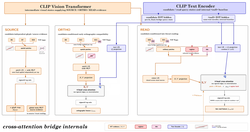 | **`bridge.cross_attention`** SOURCE / ORTHO / READ / CONTENT bridge | `[M]` | `sec:bridge_architecture` `sec:results_routing` | SOURCE/ORTHO/READ/CONTENT maps, contributions and rollouts. |
| 2 | 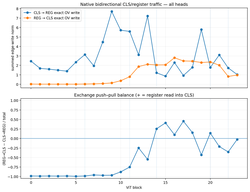 | **`bridge.backbone_dynamics`** trained-backbone / GIPU dynamics | `[M]` | `sec:mech_native_exchange` `app:early_register_formation` | Non-interventional backbone/register/workspace dynamics underlying the bridge story. |
| 3 | 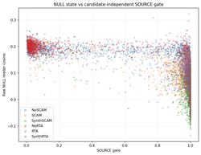 | **`bridge.read_null.hallucinations`** READ/null hallucination controls | `[M]` | `sec:results_human_audit` `sec:bridge_architecture` | No-text/unsupported-query hallucination and READ/NULL behavior. |
| 4 | 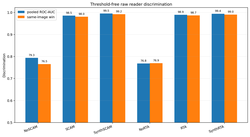 | **`bridge.read_null.tap_transplants`** late-tap READ/null transplants | `[I]` | `sec:bridge_architecture` `sec:results_routing` | Frozen late-tap transplants test what READ/NULL depends on. |
| 5 |  | **`bridge.read_null.diagnostic`** raw/calibrated READ/null diagnostics | `[M]` | `sec:results_human_audit` `sec:bridge_architecture` | Raw/calibrated READ, NULL and RN-attention diagnostics. |

## Native workspace / register circuit

| # | Preview | Experiment | Type | Paper anchor(s) | What it does |
|---:|---|---|---|---|---|
| 6 |  | **`workspace.broadcast_sinks`** NOP/broadcast sinks: OAI / GmP / trained-backbone comparison | `[M]` | `sec:mech_native_exchange` `app:early_register_formation` | NOP/broadcast-sink census and register-overlap measurements. |
| 7 | 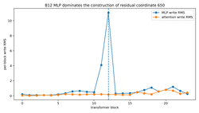 | **`workspace.broadcast_channel_interventions`** 565/650/123 causal channel interventions | `[I]` | `sec:mech_native_exchange` `sec:conv1_residual_takeover` | Causal 565/650/123 residual-channel interventions on native broadcast/readout. |
| 8 |  | **`workspace.cls_register_exchange`** CLS↔register/workspace exchange | `[M]` | `sec:mech_native_exchange` `app:early_register_formation` | Exact CLS↔register/workspace exchange and early μ1 source attribution. |
| 9 | 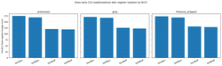 | **`workspace.cls_mu_causal`** CLS↔mu causal 2×2 / RN repeat / slot swap | `[I]` | `sec:mech_native_exchange` `app:early_register_formation` `app:rn_routing_controls` | Phase-separated CLS read/broadcast lesions, RN repeat and slot-swap causal controls. |
| 10 | 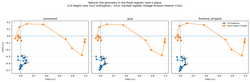 | **`workspace.cls_role_surfaces`** CLS/register role-plane surfaces | `[I]` ★μ2 (PLY) | `sec:mech_role_plane` `app:role_plane_controls` | Fixed μ1/μ2 role-plane surfaces and controlled CLS/RN displacement. |
| 11 | 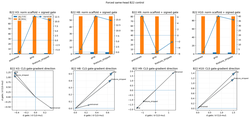 | **`workspace.qk_role_gates.scan`** late Q/K role-gate scan | `[M]` | `app:b22_qk_controls` | Late Q/K gate-gradient scan projected into the role plane. |
| 12 |  | **`workspace.qk_role_gates.same_heads`** fixed B22 same-head Q/K control | `[M]` | `app:b22_qk_controls` | Forced same-head B22 Q/K comparison across backbones. |
| 13 | 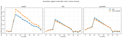 | **`workspace.register_geometry.secondary`** paired secondary register/workspace geometry | `[M]` | `sec:mech_training_reorganizes` `app:late_workspace_geometry` | Cross-fitted secondary register/workspace occupancy geometry. |
| 14 | 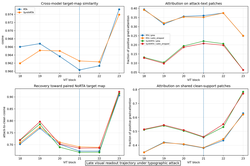 | **`workspace.register_geometry.grad_attention`** late register attribution trajectory | `[M]` | `sec:mech_training_reorganizes` | Grad×attention late attribution trajectory; diagnostic rather than ablation. |
| 15 | 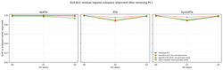 | **`workspace.register_geometry.principal_angles`** B20–B22 residual-subspace principal angles | `[M]` | `app:late_workspace_geometry` | Post-PC1 B20–B22 residual-subspace alignment and factorization. |
| 16 | 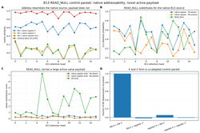 | **`workspace.register_cache_transport`** B12→B13 register/cache transport vs RN | `[M/I]` | `sec:mech_rn_address_payload` `app:rn_routing_controls` | B12 register-tail → B13 cache transport measured with RN off/on source competition. |
| 17 | 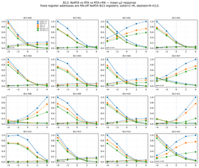 | **`workspace.rta_head_population`** RTA head-population RN factorial / OV motifs | `[I]` ★μ2 | `sec:mech_role_plane` `app:role_plane_controls` | Dataset-scale all-head μ2 slider plus RN factorial and OV/write motifs. |
| 18 | 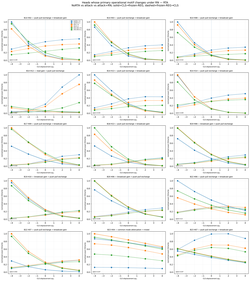 | **`workspace.rta_head_contact_sheets`** cached RN motif contact sheets | `[M]` ★μ2 | `app:role_plane_controls` | Figure/postprocess task for μ2/RN head-motif changes. |
| 19 |  | **`workspace.single_image.example`** single-image CLS/register atlas | `[M/I]` ★μ2 | `sec:mech_native_exchange` `sec:mech_role_plane` | Single-image native exchange atlas plus blockwise μ2 steering sweeps. |
| 20 | 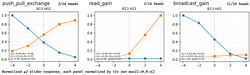 | **`workspace.single_image.motifs`** single-image all-head motif catalogue | `[I]` ★μ2 | `sec:mech_role_plane` `app:role_plane_controls` | All-block/all-head μ2-slider response motif catalogue. |
| 21 | 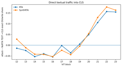 | **`workspace.text_cls_trajectory`** exact TEXT→CLS OV/write trajectory | `[M/I]` | `sec:mech_native_exchange` | Exact TEXT→CLS OV/write trajectory across models and RN states. |

## RN mechanism / universality

| # | Preview | Experiment | Type | Paper anchor(s) | What it does |
|---:|---|---|---|---|---|
| 22 |  | **`rn.control_mechanism`** synthetic single-block RN steering mechanism | `[I]` | `sec:mech_rn_address_payload` `sec:mech_rn_lowrank` | Single-block RN source substitution, active-write and low-rank sufficiency/necessity mechanism. |
| 23 | 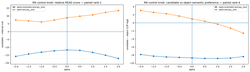 | **`rn.control_knob`** multilingual RN control-knob suite | `[I]` ★RNsurf | `app:rn_lowrank_controls` | Continuous rank-1/rank-4 RN control-coordinate manipulations. |
| 24 | 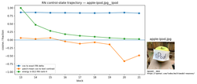 | **`rn.control_manifold`** RN local control-manifold atlas | `[I]` ★RNsurf (PLY) | `app:rn_lowrank_controls` | Local multidimensional RN control-manifold chart and reachable-state geometry. |
| 25 | 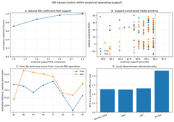 | **`rn.control_surfaces`** native multilingual RN control surfaces | `[I]` ★RNsurf (PLY) | `app:rn_lowrank_controls` `app:multilingual_rn_surface` | Native multilingual RN causal surfaces, empirical-support restriction and register-pump controls. |
| 26 | 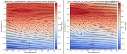 | **`rn.control_surface_flow_maps`** cached RN surface flow maps / PLY | `[M]` ★RNsurf (PLY) | `app:multilingual_rn_surface` | Cached surface gradients/flow maps and PLY export. |
| 27 | 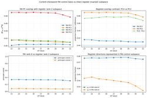 | **`rn.subspace_alignment`** RN-control PCs vs intact register subspaces | `[M]` | `app:rn_lowrank_controls` | Alignment between RN-control PCs and intact register invariant subspaces. |
| 28 |  | **`rn.stash_followup`** RN stash impersonation / B11→B13 follow-up | `[M/I]` | `sec:mech_rn_address_payload` `app:rn_routing_controls` | RN stash impersonation, native-source substitution and K/V addressing/payload follow-up. |
| 29 | 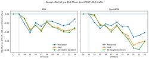 | **`rn.text_relocation`** SOURCE/PIECE text-evidence relocation after RN | `[M/I]` | `sec:mech_native_exchange` `sec:mech_training_reorganizes` | Where source-PIECE text evidence moves after RN insertion. |
| 30 | 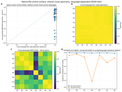 | **`rn.bridge_transplant`** bridge/text/visual transplant universality | `[I]` ★RNsurf (PLY) | `sec:mech_rn_transfer` `sec:mech_rn_address_payload` `app:rn_lowrank_controls` | Visual/text/bridge transplants, pump ablations and same-coordinate RN control surfaces. |
| 31 | 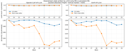 | **`rn.touch_go_transfer`** RN transplant: persistent vs B13 touch-and-go | `[I]` | `sec:mech_rn_touch_go` | Persistent RN versus B13-only touch-and-go transplantation. |

## Figure/postprocess tasks

| # | Preview | Experiment | Type | Paper anchor(s) | What it does |
|---:|---|---|---|---|---|
| 32 |  | **`figures.role_text_atlas`** role-vs-site text atlas | `[M]` ★μ2 | `sec:mech_role_plane` `app:role_plane_controls` | CPU postprocess tying μ2 role grammar to text-site traffic. |
| 33 |  | **`figures.rn_mechanism`** compact RN mechanism paper figures | `[M]` | `sec:mech_rn_address_payload` `sec:mech_rn_lowrank` | Cached paper-figure compositor for RN address/payload and low-rank pulse. |

## Conv1 / early routing

| # | Preview | Experiment | Type | Paper anchor(s) | What it does |
|---:|---|---|---|---|---|
| 34 | 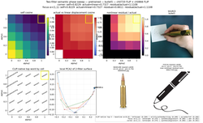 | **`conv1.gpic_manifold`** Conv1 semantic manifold with model-matched GPIC embedding banks | `[I]` ★GPIC | `sec:conv1_manifold_surfing` | Conv1 perturbation &#x27;manifold surfing&#x27; with model-matched GPIC nearest-neighbor retrieval. |
| 35 | 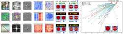 | **`conv1.xattn_functional_atlas`** x-attn Conv1 functional atlas / culprit and pair discovery | `[I]` | `sec:conv1_causal_atlas` `app:conv1_excursion_controls` | Seven-condition Conv1 causal atlas, culprit discovery and x-attn displacement manifolds. |
| 36 | 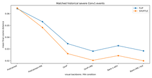 | **`conv1.vanilla_functional_atlas`** vanilla/GmP/bare-xattn Conv1 functional atlas | `[I]` | `sec:conv1_causal_atlas` `app:conv1_excursion_controls` | Matched Conv1 perturbation atlas for pretrained/GmP/bare-xattn backbones. |
| 37 | 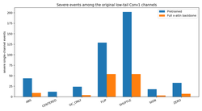 | **`conv1.vanilla_functional_atlas_rn`** vanilla/GmP/bare-xattn Conv1 atlas with transplanted RN | `[I]` | `sec:conv1_causal_atlas` `app:conv1_excursion_controls` | Same fixed Conv1 events with transplanted RN across vanilla-family backbones. |
| 38 | 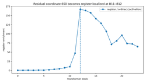 | **`conv1.residual_axis_lineage`** Conv1 residual-axis lineage / classification | `[M]` | `sec:conv1_residual_takeover` `app:conv1_excursion_controls` | Depthwise ancestry/takeover of residual coordinates 650, 565 and controls. |
| 39 | 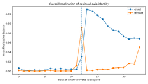 | **`conv1.residual_axis_swap_650_565`** 650/565 residual-axis swap sweep | `[I]` | `sec:conv1_residual_takeover` | Block-local and persistent 650↔565 coordinate-swap interventions. |
| 40 |  | **`conv1.residual_axis_lineage_rn`** RN-variant residual-axis lineage / classification | `[M/I]` | `sec:conv1_residual_takeover` | Residual-axis lineage repeated with RN variants to locate RN relative to B12 construction. |
| 41 | 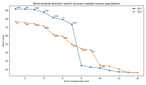 | **`conv1.mlp_neuron_discovery`** blind MLP-neuron discovery from residual axes | `[M]` | `sec:conv1_residual_takeover` `app:conv1_excursion_controls` | Blind residual-side recovery of B11/B12 register-neuron populations. |
| 42 |  | **`conv1.b20_writeback_neurons`** B20 writeback-neuron discovery | `[M]` | `sec:conv1_b20_writeback` `app:conv1_excursion_controls` | Blind discovery of sparse B20 register/workspace writeback neurons. |
| 43 | 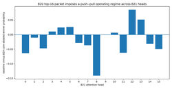 | **`conv1.b20_sharpeners_flatteners`** B20 sharpener/flattener subfamilies | `[I]` | `sec:conv1_b20_writeback` `app:conv1_excursion_controls` | Signed B20 sharpener/flattener neuron-family ablations and B21 routing effects. |
| 44 | 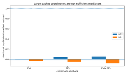 | **`conv1.b20_pushpull_650_715`** B20 650/715 push-pull mediation | `[I]` | `sec:conv1_b20_writeback` `app:conv1_excursion_controls` | Coordinate add-back/removal tests for whether 650/715 mediate the B20 actuator packet. |
| 45 | 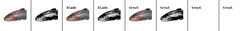 | **`conv1.register_allocator_tomography`** Conv1 / positional register-allocator tomography | `[I]` | `sec:conv1_causal_atlas` `sec:conv1_role_allocation` | Causal Conv1/positional → early-scanner → register-allocation tomography. |
| 46 | 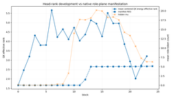 | **`conv1.roleplane_texture_rank.head_rank`** all-block head true-rank / rigidity | `[M]` | `sec:conv1_role_allocation` `app:role_allocation_controls` | All-block QK true-rank/rigidity and visual-tracker phenotype census. |
| 47 | 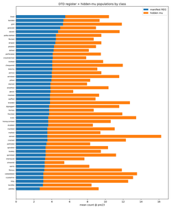 | **`conv1.roleplane_texture_rank.texture_inverse`** DTD/math texture role-plane + inverse-LAST | `[M]` | `sec:conv1_role_allocation` `app:role_allocation_controls` | DTD/synthetic register allocation, role-plane occupancy and inverse-LAST spectral analysis. |
| 48 |  | **`conv1.roleplane_texture_rank.compact`** compact role-plane / texture / rank handoff | `[M]` | `sec:conv1_role_allocation` `app:role_allocation_controls` | CPU postprocess/compact summary of rank, texture and role-allocation results. |
| 49 |  | **`conv1.visualtextual_provenance`** visual/textual provenance + role-plane atlas | `[M/I]` | `sec:text_provenance_geometry` `app:text_provenance_controls` | Visual/text/mix provenance atlas, role-plane removal and causal Conv1 text-channel controls. |
| 50 | 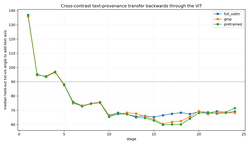 | **`conv1.visualtextual_text_direction`** visual/textual text-direction trajectory atlas | `[M]` | `sec:text_provenance_geometry` `app:text_provenance_controls` | Layerwise transferable text-direction trajectory and synthetic generalization. |

## Utility / audit

| # | Preview | Experiment | Type | Paper anchor(s) | What it does |
|---:|---|---|---|---|---|
| 51 | — | **`audit.read_probe_router`** static READ-probe/router checkpoint audit manual utility | `[M]` | `sec:bridge_architecture` `methods trust-router equations` | Static checkpoint/config audit for optional READ probe and trust-router input width. |
